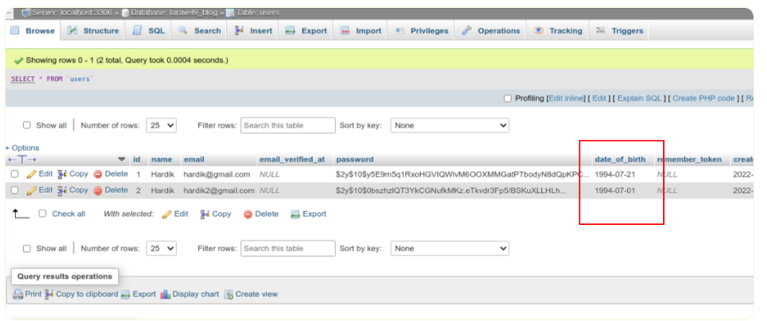

# laravel9_eloquent_mutators_and_ccessors
- tìm hiểu mutators và accessors trong laravel 9
+ Laravel cung cấp  Mutators và Accessors  trong Eloquent. Trước hết, tôi sẽ cung cấp cho bạn một định nghĩa đơn giản về Accessors và Mutators là gì trong Laravel Eloquent, Sau đó, tôi sẽ cung cấp cho bạn một ví dụ rất đơn giản để bạn hiểu nó hoạt động như thế nào.
- Accessors tạo một thuộc tính tùy chỉnh trên đối tượng mà bạn có thể truy cập như thể nó là một cột cơ sở dữ liệu.
- Mutator là một cách để thay đổi dữ liệu khi nó được thiết lập vào bảng cơ sở dữ liệu.
=> nếu chúng ta có một trường được gọi là "ngày sinh" với kiểu dữ liệu ngày trong mô hình người dùng. Bạn sẽ cung cấp cho người dùng nhập ngày tháng năm sinh ở định dạng "m / d / Y", nhưng cơ sở dữ liệu chấp nhận "Ymd" thì bạn luôn thay đổi định dạng ngày tháng trước khi chèn bản ghi vào cơ sở dữ liệu. Điều tương tự khi bạn truy xuất các bản ghi từ cơ sở dữ liệu thì bạn có hiển thị ngày "m / d / Y" cho người dùng. vì vậy, có thể có nhiều nơi bạn phải tạo bản ghi và hiển thị dữ liệu, sau đó bạn phải làm lại điều tương tự. laravel cung cấp một giải pháp để tự động thay đổi giá trị trước khi chèn và trước khi lấy dữ liệu bằng Accessors và Mutators.
## 1. Install Laravel 9
```Dockerfile
composer create-project laravel/laravel laravel9_eloquent_mutators_and_ccessors
```
## 2. Update Migration and Model
- Vào database/migrations/2014_10_12_000000_create_users_table.php
```Dockerfile
<?php
  
use Illuminate\Database\Migrations\Migration;
use Illuminate\Database\Schema\Blueprint;
use Illuminate\Support\Facades\Schema;
  
return new class extends Migration
{
    /**
     * Run the migrations.
     *
     * @return void
     */
    public function up()
    {
        Schema::create('users', function (Blueprint $table) {
            $table->id();
            $table->string('name');
            $table->string('email')->unique();
            $table->timestamp('email_verified_at')->nullable();
            $table->string('password');
            $table->date('date_of_birth');
            $table->rememberToken();
            $table->timestamps();
        });
    }
  
    /**
     * Reverse the migrations.
     *
     * @return void
     */
    public function down()
    {
        Schema::dropIfExists('users');
    }
};
```
- Chạy lệnh 
```Dockerfile
php artisan migrate
```
- VÀo app/Models/User.php
```Dockerfile
<?php
  
namespace App\Models;
  
use Illuminate\Contracts\Auth\MustVerifyEmail;
use Illuminate\Database\Eloquent\Factories\HasFactory;
use Illuminate\Foundation\Auth\User as Authenticatable;
use Illuminate\Notifications\Notifiable;
use Laravel\Sanctum\HasApiTokens;
use Illuminate\Database\Eloquent\Casts\Attribute;
use Carbon\Carbon;
  
class User extends Authenticatable
{
    use HasApiTokens, HasFactory, Notifiable;
    /**
     * The attributes that are mass assignable.
     *
     * @var array

     */
    protected $fillable = [
        'name',
        'email',
        'password',
        'date_of_birth'
    ];
  
    /**
     * The attributes that should be hidden for serialization.
     *
     * @var array

     */
    protected $hidden = [
        'password',
        'remember_token',
    ];
  
    /** 
     * The attributes that should be cast.
     *
     * @var array

     */
    protected $casts = [
        'email_verified_at' => 'datetime',
    ];
  
    /**
     * Interact with the user's first name.
     *
     * @param  string  $value
     * @return \Illuminate\Database\Eloquent\Casts\Attribute
     */
    protected function dateOfBirth(): Attribute
    {
        return new Attribute(
            get: fn ($value) =>  Carbon::parse($value)->format('m/d/Y'),
            set: fn ($value) =>  Carbon::parse($value)->format('Y-m-d'),
        );
    }
}
```
## 3.Create Controller

```Dockerfile
php artisan make:controller UserController
```
- Vào app/Http/Controllers/UserController.php 
```Dockerfile
<?php
  
namespace App\Http\Controllers;
  
use Illuminate\Http\Request;
use App\Models\User;
  
class UserController extends Controller
{
    /**
     * Write code on Method
     *
     * @return response()
     */
    public function create()
    {
        $input = [
            'name' => 'Hardik',
            'email' => 'hardik2@gmail.com',
            'password' => bcrypt('123456'),
            'date_of_birth' => '07/21/1994'
        ];
  
        $user = User::create($input);
   
        dd($user);
    }
  
    /**
     * Write code on Method
     *
     * @return response()
     */
    public function show()
    {
        $user = User::first();
  
        dd($user->toArray());
    }
}
```
## 4.Create and Add Routes
- Vào routes/web.php
```Dockerfile
<?php
  
use Illuminate\Support\Facades\Route;
  
use App\Http\Controllers\UserController;
  
/*
|--------------------------------------------------------------------------
| Web Routes
|--------------------------------------------------------------------------
|
| Here is where you can register web routes for your application. These
| routes are loaded by the RouteServiceProvider within a group which
| contains the "web" middleware group. Now create something great!
|
*/
  
Route::controller(UserController::class)->group(function(){
    Route::get('create-user', 'create');
    Route::get('get-user', 'show');
});
```
## 5. Run
```Dockerfile
php artisan serve
```
- Bây giờ, hãy truy cập trình duyệt web của bạn, nhập URL đã cho và xem đầu ra ứng dụng:
http: // localhost: 8000 / create-user
- Nó sẽ tạo người dùng giống như ảnh chụp màn hình dưới đây:



- Đầu ra cho Accessor
Bây giờ, hãy truy cập trình duyệt web của bạn, nhập URL đã cho và xem đầu ra ứng dụng:
http: // localhost: 8000 / get-user
```Dockerfile
mảng: 7 [

  "id" => 1

  "name" => "Hardik"

  "email" => "hardik@gmail.com"

  "email_verified_at" => null

  "date_of_birth" => "21/07/1994"

  "create_at" => "2022-02-11T04: 37: 46.000000Z"

  "updated_at" => "2022-02-11T04: 37: 46.000000Z"

]
```


